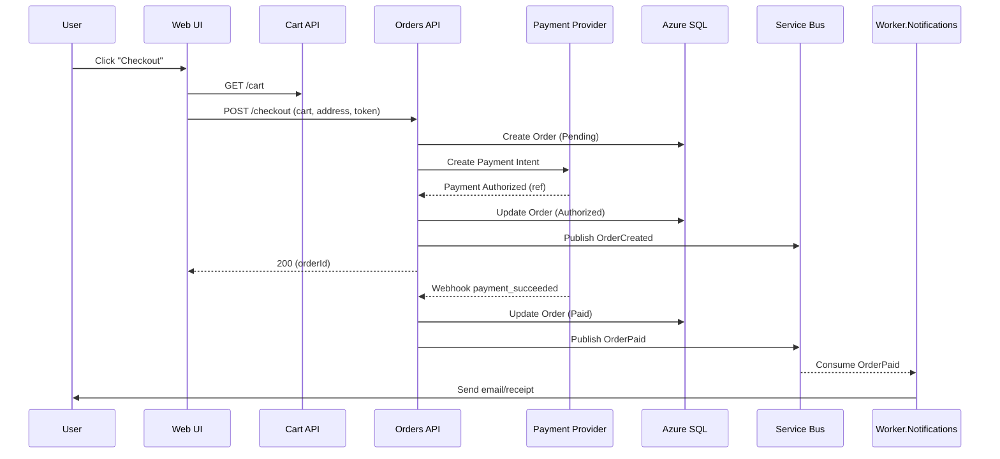

#Checkout flow (sequence)

```mermaid

sequenceDiagram
  participant U as User
  participant UI as Web UI
  participant Cart as Cart API
  participant Orders as Orders API
  participant PSP as Payment Provider
  participant SQL as Azure SQL
  participant Bus as Service Bus
  participant W as Worker.Notifications

  U->>UI: Click "Checkout"
  UI->>Cart: GET /cart
  UI->>Orders: POST /checkout (cart, address, token)
  Orders->>SQL: Create Order (Pending)
  Orders->>PSP: Create Payment Intent
  PSP-->>Orders: Payment Authorized (ref)
  Orders->>SQL: Update Order (Authorized)
  Orders->>Bus: Publish OrderCreated
  Orders-->>UI: 200 (orderId)

  PSP-->>Orders: Webhook payment_succeeded
  Orders->>SQL: Update Order (Paid)
  Orders->>Bus: Publish OrderPaid
  Bus-->>W: Consume OrderPaid
  W->>U: Send email/receipt
```
