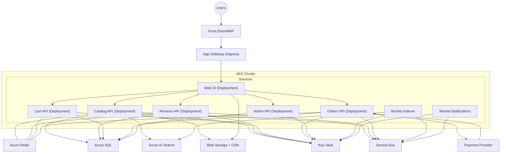

# Cloud Native Diagram = Phase 2

Scale-out (AKS + ACR) — when you outgrow App Service

```mermaid

flowchart TB
  User((Users)) --> FD["Front Door/WAF"]
  FD --> AGW["App Gateway (Ingress)"]

  subgraph AKS["AKS Cluster"]
    subgraph Services
      Web["Web UI (Deployment)"]
      CatAPI["Catalog API (Deployment)"]
      RevAPI["Reviews API (Deployment)"]
      CartAPI["Cart API (Deployment)"]
      OrdAPI["Orders API (Deployment)"]
      AdminAPI["Admin API (Deployment)"]
      Worker1["Worker.Indexer"]
      Worker2["Worker.Notifications"]
    end
  end

  AGW --> Web
  Web --> CatAPI
  Web --> RevAPI
  Web --> CartAPI
  Web --> OrdAPI
  Web --> AdminAPI

  CatAPI --- Redis["Azure Redis"]
  RevAPI --- Redis
  CartAPI --- Redis
  OrdAPI --- Redis

  CatAPI --> SQL["Azure SQL"]
  RevAPI --> SQL
  CartAPI --> SQL
  OrdAPI --> SQL
  AdminAPI --> SQL

  CatAPI --> Search["Azure AI Search"]
  Worker1 --> Search

  CatAPI --> Blob["Blob Storage + CDN"]
  Web --> Blob

  OrdAPI --> PSP["Payment Provider"]
  PSP --> OrdAPI

  CatAPI --> KV["Key Vault"]
  RevAPI --> KV
  CartAPI --> KV
  OrdAPI --> KV
  AdminAPI --> KV
  Worker1 --> KV
  Worker2 --> KV

  CatAPI --> Bus["Service Bus"]
  RevAPI --> Bus
  OrdAPI --> Bus
  Worker1 --> Bus
  Worker2 --> Bus
```
