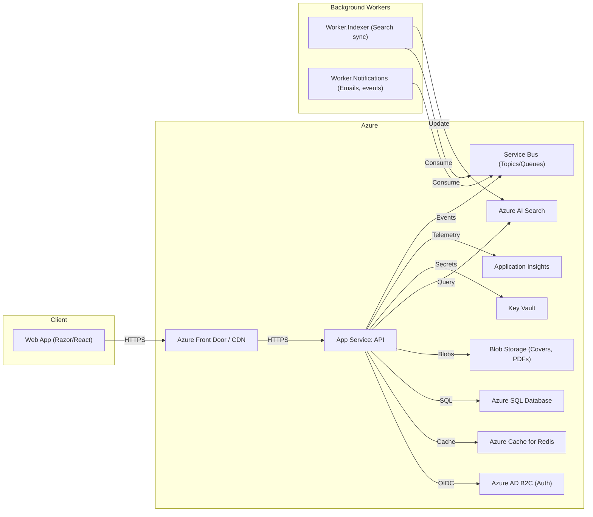

# Cloud Native Architecture Diagram

This diagram shows the high-level architecture of our cloud-native application.

```mermaid
flowchart LR
subgraph Client["Client"]
WebUI["Web App (Razor/React)"]
end

subgraph Azure["Azure"]
FrontDoor["Azure Front Door / CDN"]
AppSvc["App Service: API"]
Redis["Azure Cache for Redis"]
SQL["Azure SQL Database"]
Blob["Blob Storage (Covers, PDFs)"]
Search["Azure AI Search"]
Bus["Service Bus (Topics/Queues)"]
KV["Key Vault"]
AI["Application Insights"]
B2C["Azure AD B2C (Auth)"]
end

subgraph Workers["Background Workers"]
Indexer["Worker.Indexer (Search sync)"]
Notify["Worker.Notifications (Emails, events)"]
end

WebUI -- HTTPS --> FrontDoor
FrontDoor -- HTTPS --> AppSvc

AppSvc -- OIDC --> B2C
AppSvc -- Cache --> Redis
AppSvc -- SQL --> SQL
AppSvc -- Blobs --> Blob
AppSvc -- Query --> Search
AppSvc -- Secrets --> KV
AppSvc -- Telemetry --> AI
AppSvc -- Events --> Bus

Indexer -- Consume --> Bus
Indexer -- Update --> Search
Notify -- Consume --> Bus
```
