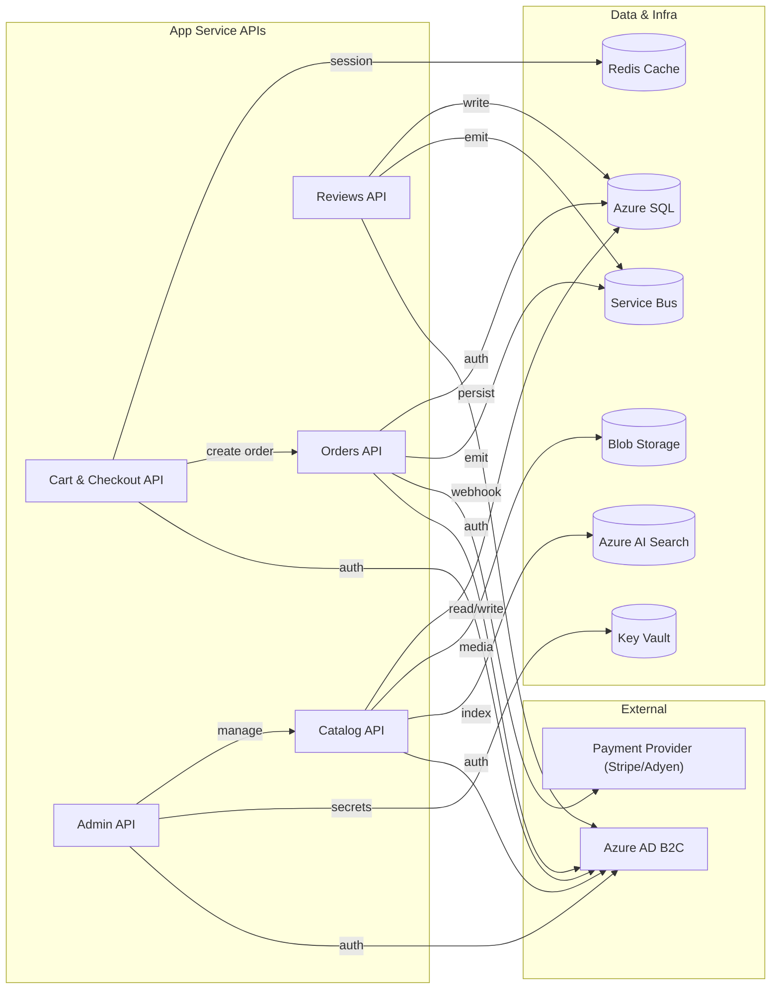

# Cloud Native detailed domain view Diagram

This diagram shows the detailed domain view -level architecture of our cloud-native application.

```mermaid
flowchart LR
subgraph APIs["App Service APIs"]
Catalog["Catalog API"]
Reviews["Reviews API"]
Cart["Cart & Checkout API"]
Orders["Orders API"]
Admin["Admin API"]
end

subgraph Data["Data & Infra"]
SQL[(Azure SQL)]
Search[(Azure AI Search)]
Redis[(Redis Cache)]
Blob[(Blob Storage)]
Bus[(Service Bus)]
KV[(Key Vault)]
end

subgraph Ext["External"]
PSP["Payment Provider (Stripe/Adyen)"]
B2C["Azure AD B2C"]
end

Catalog -- read/write --> SQL
Catalog -- media --> Blob
Catalog -- index --> Search
Reviews -- write --> SQL
Reviews -- emit --> Bus
Cart -- session --> Redis
Cart -- create order --> Orders
Orders -- persist --> SQL
Orders -- emit --> Bus
Orders -- webhook --> PSP
Admin -- manage --> Catalog
Admin -- secrets --> KV

Catalog -- auth --> B2C
Reviews -- auth --> B2C
Cart -- auth --> B2C
Orders -- auth --> B2C
Admin -- auth --> B2C
```
